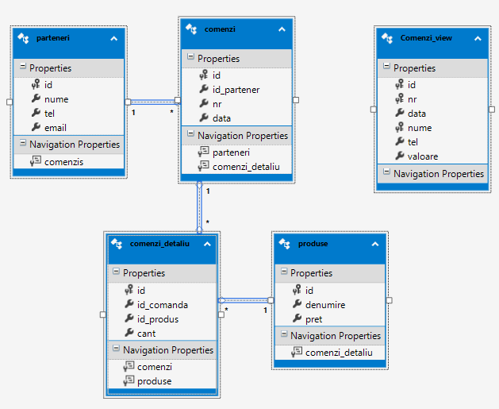
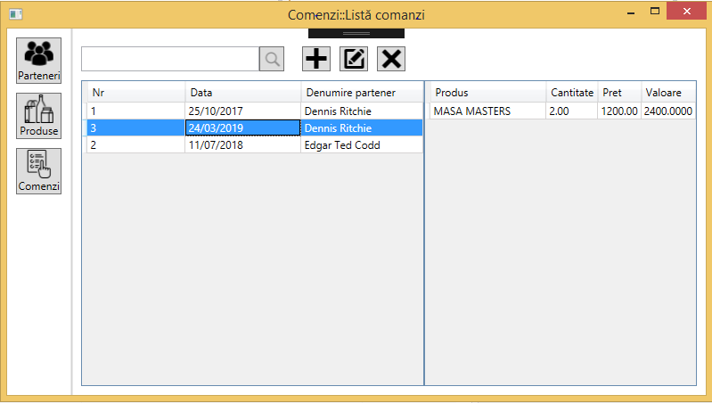


## Scurtă descriere
  - baza de date (sqlServer) se numește Comenzi (se poate modifica din string-ul de conectare - vezi in fisierul) App.config
 - directorul SQL contine scripturi SQL pentru crearea obiectelor din baza de date (001-comenzi-create-obj.sql) 
   si un script pentru generarea unui set de date de test (002-comenzi-date-test-sql) 
 - am creat și un view pe comenzi, in ideea ca voi face si un raport 

#### Relații între entități

 - comenzi_view - incă nu este folosit în aplicație
 
Am folosit SQL Server 2017 si EntityFramework 6 cu mici modificari pe codul generat - nu stiu dacă-i cea mai bună soluție.

Pun aici si câteva capturi de ecran:

Toate machetele includ un mic toolbar care permite:
 -  căutarea entităților (se introduce secventa de cautat urmată de Enter sau click pe butonul Search (cu lupa)
- operațiile comune de adăugare / modificare / ștergere, implementate pe baza unui `ICommand`. Operațiile de modificare și ștergere sunt active doar în cazul în care există o entitate selectată în listă.

 

